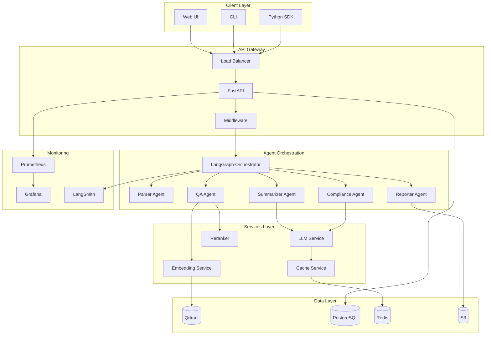
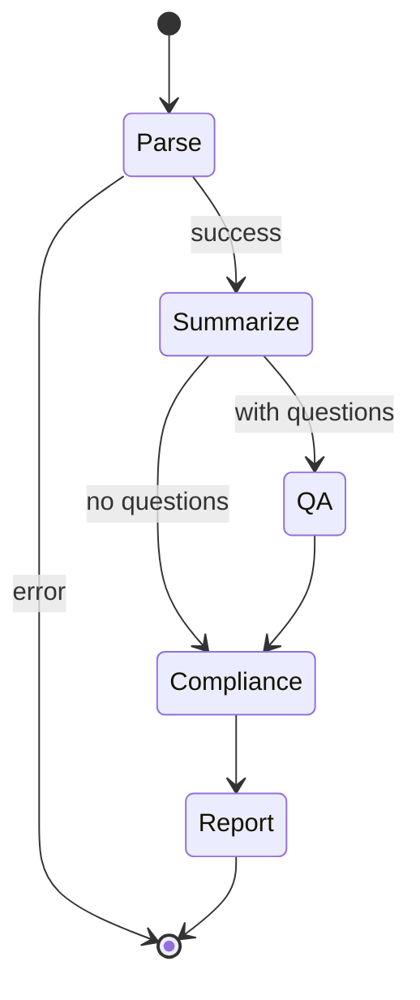

# DocuMind Architecture

## System Overview

DocuMind is a production-ready multi-agent AI system for enterprise document analysis. It uses LangGraph to orchestrate 6 specialized agents that process documents through parsing, summarization, Q&A, compliance checking, and report generation.

## Architecture Diagram



## Agent Pipeline



## Component Details

### 1. API Layer

| Component | Technology | Purpose |
|-----------|------------|---------|
| Gateway | FastAPI | REST API, async request handling |
| Auth | JWT/API Key | Authentication |
| Rate Limit | In-memory/Redis | Request throttling |
| Validation | Pydantic | Request/response validation |

### 2. Agent System

| Agent | Purpose | LLM Used |
|-------|---------|----------|
| Parser | Document extraction (PDF, DOCX, OCR) | None |
| Summarizer | Executive/detailed summaries | GPT-4o |
| QA | Question answering with RAG | GPT-4o |
| Compliance | Risk detection, GDPR checks | Claude 3.5 |
| Reporter | PDF report generation | None |

### 3. RAG Pipeline

```
Document → Chunking → Embedding → Vector Store
                                       ↓
Query → Embedding → Search → Rerank → Context → LLM → Answer
```

**Chunking Strategies:**
- Recursive character (default)
- Semantic (embedding-based)
- Structure-aware (headers/sections)

**Retrieval:**
- Similarity search with score threshold
- MMR for diversity
- Cohere reranking for relevance

### 4. Model Routing

```python
# Automatic routing based on complexity
Query Complexity → Low    → gpt-4o-mini (fast, cheap)
                → Medium → gpt-4o (balanced)
                → High   → claude-3-5-sonnet (quality)
```

## Data Flow

### Document Processing

1. **Upload**: Document uploaded via API → stored in S3
2. **Parse**: Parser agent extracts text, splits into chunks
3. **Index**: Chunks embedded → stored in Qdrant
4. **Analyze**: Agents process based on requested tasks
5. **Store**: Results saved to PostgreSQL
6. **Report**: PDF generated → stored in S3

### Request Lifecycle

```
Request → Auth → Rate Limit → Validate → Process → Cache → Response
            ↓                                 ↓
         Reject                           Metrics
```

## Deployment Architecture

### AWS ECS (Production)

```
┌─────────────────────────────────────────────────┐
│                     VPC                         │
│  ┌─────────────────────────────────────────┐    │
│  │           Public Subnets                │    │
│  │  ┌─────┐                     ┌─────┐    │    │
│  │  │ ALB │                     │ NAT │    │    │
│  │  └─────┘                     └─────┘    │    │
│  └─────────────────────────────────────────┘    │
│  ┌─────────────────────────────────────────┐    │
│  │           Private Subnets               │    │
│  │  ┌──────────┐  ┌─────────┐  ┌────────┐  │    │
│  │  │ ECS API  │  │   RDS   │  │ Redis  │  │    │
│  │  │  Fargate │  │Postgres |  │        │  │    │
│  │  └──────────┘  └─────────┘  └────────┘  │    │
│  └─────────────────────────────────────────┘    │
└─────────────────────────────────────────────────┘
```

### Kubernetes (Alternative)

- Deployment with HPA (2-10 replicas)
- Pod anti-affinity for HA
- Ingress with TLS
- ConfigMaps for configuration
- Secrets for credentials

## Monitoring & Observability

| Metric Category | Examples |
|----------------|----------|
| API | Request rate, latency (p50/p95/p99), error rate |
| LLM | Token usage, latency by model, error rate |
| Agents | Execution count, duration, success rate |
| Infrastructure | Cache hit rate, vector ops, queue depth |

### Alerting Thresholds

| Alert | Condition | Severity |
|-------|-----------|----------|
| High Error Rate | > 5% for 5m | Critical |
| High Latency | p95 > 2s for 5m | Warning |
| LLM Errors | > 10% for 5m | Warning |
| Service Down | Health check fails | Critical |

## Security

- **Transport**: TLS 1.3 everywhere
- **Auth**: API key + JWT tokens
- **Secrets**: AWS Secrets Manager / K8s Secrets
- **Network**: Private subnets, security groups
- **Data**: Encryption at rest (S3, RDS, Redis)
- **Scanning**: Bandit (SAST), Trivy (container)

## Scalability

- **API**: Horizontal scaling via ECS/K8s
- **Vector Store**: Qdrant cluster mode
- **Cache**: Redis cluster with read replicas
- **Database**: RDS Multi-AZ with read replicas
- **Storage**: S3 (virtually unlimited)
